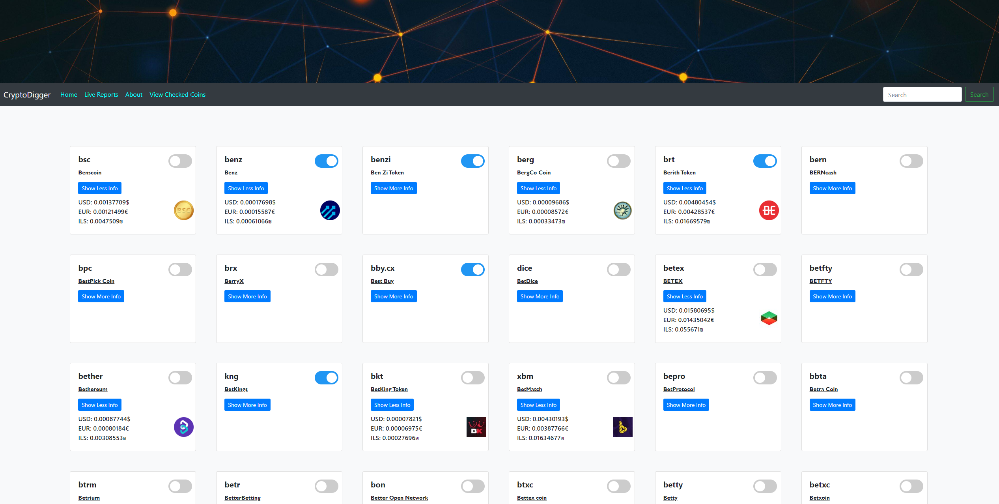
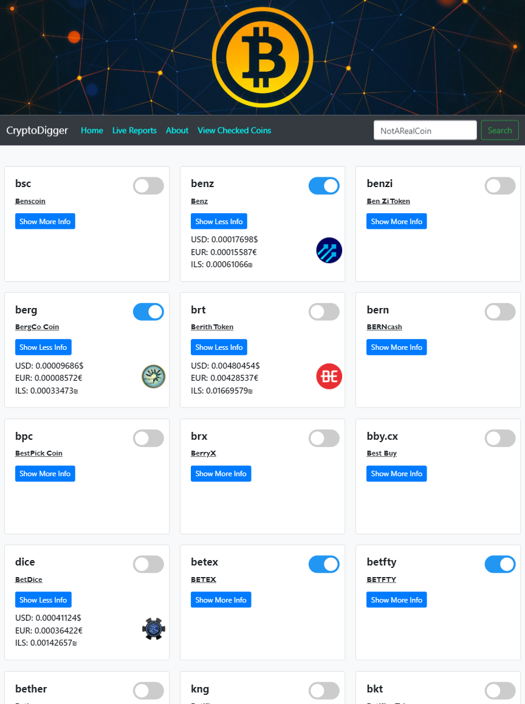
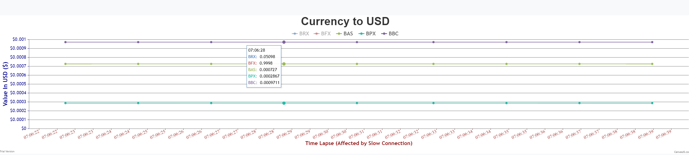
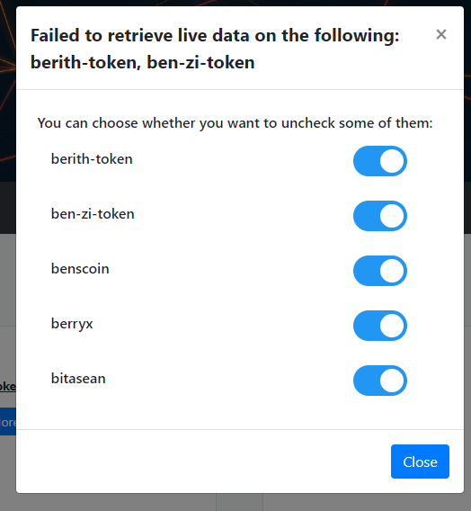
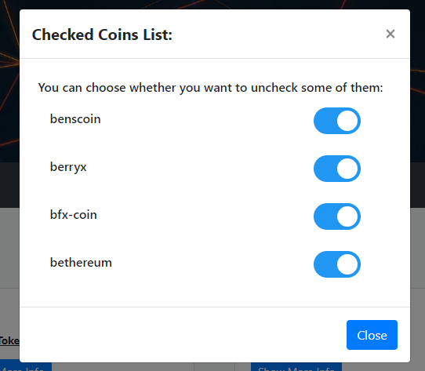
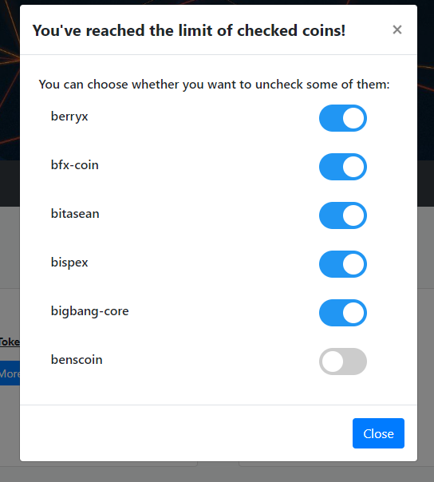
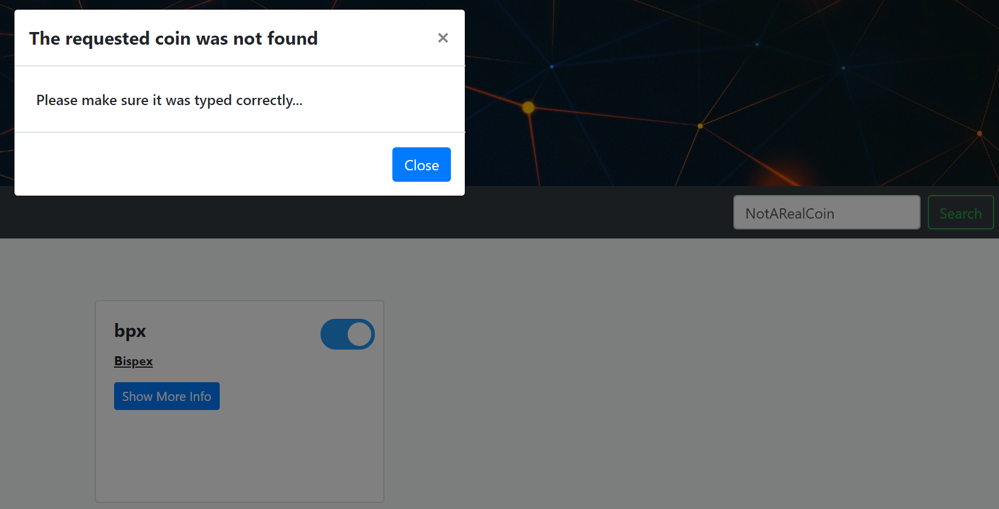

# CryptoCurrency_Tracker

CryptoCurrency Tracker SPA, that relies heavily on jQuery and Ajax (RESTful API).

## Topics:

* HTML + CSS
  - New HTML5 tags
  - CSS3 media queries and advanced selectors
  - Dynamic page layouts
  - Bootstrap & flex
* JavaScript
  - Objects
  - Callbacks, Promises, Async Await
  - jQuery
  - Single Page Application foundations
  - Events
  - Ajax (RESTful API)
  - CanvasJS
  - Documentation
* External API’s

## Core Foundations:

 1. Toggled Checkboxes' ID are saved and stored in localStorage.
    This is done under the assumption that in the most probable case, if a user wanted to view live reports on a
    specific coin on day "X", then he will also want to track the same coin again on the day he returns to the site.

 2.  Additional coin information that is retrieved in the event of clicking on the 'Show More Info' button, will be stored
     in a cache array. An imminent clean up of that information will begin right afterwards, deleting the information
     after two minutes.
     Once two minutes have passed, pressing the same show more Info button again will retrieve new information from the API.
     
 3.  You may choose to display up to 5 different coins at once in the live reports graph. 

### Main Page:

### Mobile Friendly:

### Live Reports / Data Feed on selected coins:

### Examples of Error / Message Handling with Modal:

### Example of an Invalid Search for a specific coin:

